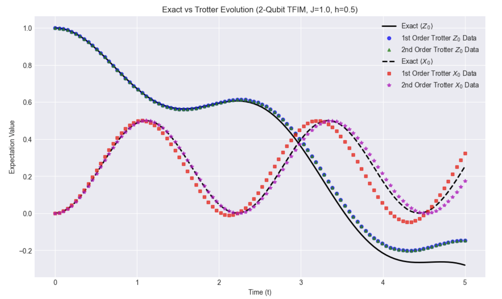
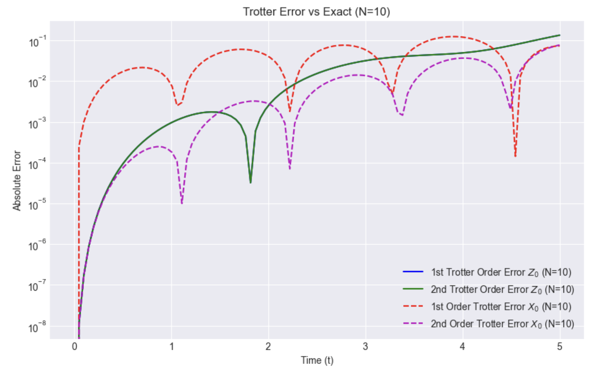

# Hamiltonian Simulation: Transverse-Field Ising Model (TFIM) via Trotterization

> Developed as supplemental material for Quantum Formalism's "[Lie Groups with Applications](https://quantumformalism.academy/lie-groups-with-applications)" course (Lecture 6).

> **Note:** *Project code developed under contract for Quantum Formalism and will be made publicly available in the official Quantum Formalism repository soon. This repository provides a description, key concepts, and visuals of the project.*

> *See my full portfolio at: [https://bhepler.com/portfolio/](https://brainhelper.wordpress.com/data-science-portfolio/)*

## Goal

To simulate the quantum time evolution of the Transverse-Field Ising Model (TFIM), a fundamental model in quantum magnetism, using both exact matrix exponentiation and approximate Trotter-Suzuki decomposition methods. The project aims to visualize the dynamics and analyze the Trotter approximation error, connecting it to the Baker-Campbell-Hausdorff (BCH) formula from Lie theory.

## Key Concepts & Relevance

*   **Quantum Mechanics:** Hamiltonian Simulation, Time Evolution Operator $U(t) = \exp(-iHt)$, Schrödinger Equation, Expectation Values.
*   **Condensed Matter Physics:** Transverse-Field Ising Model (TFIM).
*   **Lie Theory:** Matrix Exponential, Lie Brackets, Baker-Campbell-Hausdorff (BCH) Formula.
*   **Quantum Computing Algorithms:** Trotterization (Trotter-Suzuki Decomposition) as a core technique for digital quantum simulation.
*   **Numerical Methods:** Matrix Exponentiation, Approximation Algorithms, Error Analysis.
*   **Relevance:** Hamiltonian simulation is a key application area for quantum computers. Understanding Trotterization and its error sources is crucial for designing and analyzing quantum algorithms for simulating physical systems.

## Implementation & Activities

*   **Constructed Hamiltonians** for the TFIM for a 2-qubit system and scaled to a 2x3 (6-qubit) 2D lattice using tensor products of Pauli operators (**NumPy**).
*   **Simulated exact quantum time evolution** $U(t) = \exp(-iHt)$ using matrix exponentiation (**SciPy**'s `linalg.expm`).
*   Calculated and **visualized** the time evolution of expectation values (e.g., single-site magnetization $\langle Z_0 \rangle$, $\langle X_0 \rangle$) for an initial state (e.g., $|00\dots 0\rangle$) under exact evolution (**Matplotlib**).
*   Demonstrated the non-commutativity of the interaction ($H_{int} \propto \sum ZZ$) and field ($H_{field} \propto \sum X$) terms, necessitating approximation methods like Trotterization.
*   **Implemented 1st and 2nd order Trotter-Suzuki decomposition** algorithms ($U \approx (e^{-iH_1 \delta t} e^{-iH_2 \delta t})^N$ and symmetric version) to approximate the time evolution numerically (**NumPy, SciPy**).
*   **Compared** the expectation values obtained from Trotter simulations against the exact results.
*   **Analyzed and visualized** the absolute Trotter error over time, demonstrating the different scaling behaviors ($O(t^2/N)$ vs $O(t^3/N^2)$ for total error) predicted by the Baker-Campbell-Hausdorff (BCH) formula and the role of the Lie bracket $[H_1, H_2]$.

## Technologies & Skills

*   **Languages:** Python
*   **Libraries:** NumPy, SciPy (linalg.expm), Matplotlib
*   **Concepts:** Lie Theory (Matrix Exponential, BCH Formula, Lie Brackets), Quantum Mechanics (Hamiltonian Simulation, Schrödinger Equation), Quantum Algorithms (Trotterization), Condensed Matter Physics (Ising Model), Pauli Matrices, Tensor Products, Numerical Methods, Error Analysis, Visualization.

## Visualizations

*Figure 1: Comparison of expectation values (e.g., $\langle Z_0 \rangle$, $\langle X_0 \rangle$) over time calculated using exact evolution vs. 1st and 2nd order Trotter approximations.*

*Figure 2: Log-scale plot of the absolute error between Trotter approximations and exact evolution, demonstrating the faster convergence of the 2nd order method.*

## Theoretical Background

This project illustrates the core principle of quantum simulation where time evolution is governed by $U(t) = \exp(-iHt)$. When $H = H_1 + H_2$ with $[H_1, H_2] \neq 0$, the Trotter-Suzuki formulas approximate $U(t)$ using products of exponentials of the simpler terms $H_1, H_2$. The Baker-Campbell-Hausdorff (BCH) formula precisely relates the product of exponentials to the exponential of a sum involving commutators, explaining the source and scaling of the Trotter error.
